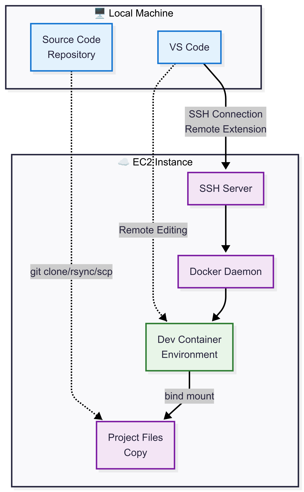
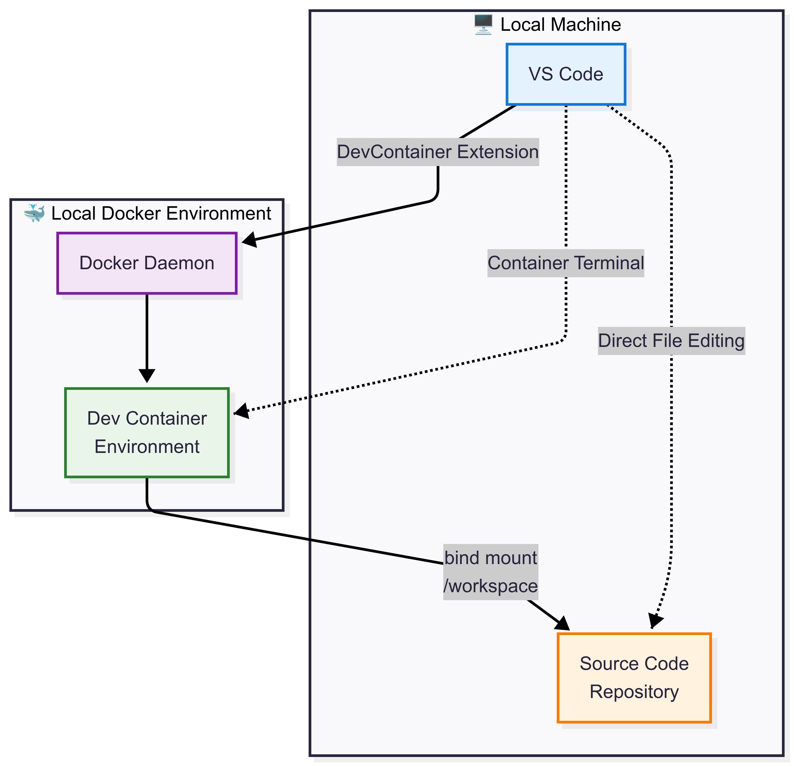
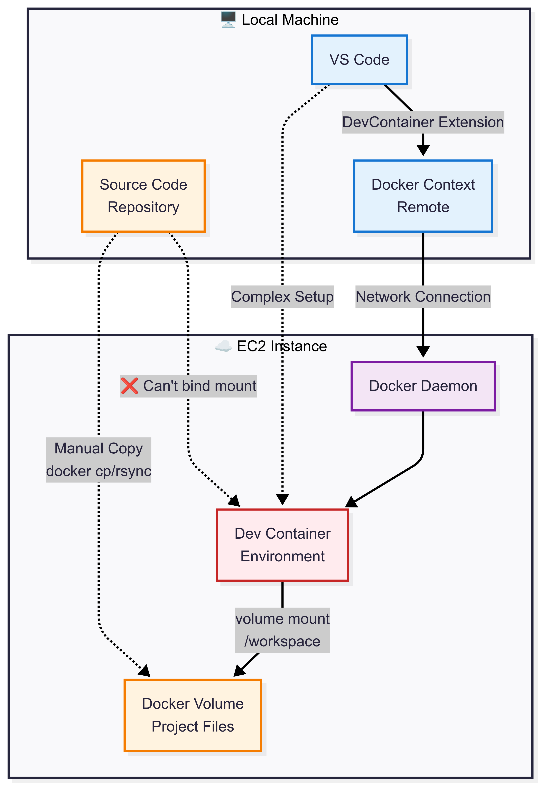

# Dev Container Solutions

## Solution 1: Remote SSH + DevContainer

### Prerequisites
- **EC2 Instance**: Running with sufficient resources (2+ GB RAM recommended)
- **SSH Access**: SSH key pair configured for EC2 access
- **Network**: Stable internet connection, SSH port (22) accessible

### Software Requirements
#### On Local Machine:
- VS Code
- Remote-SSH extension
- Dev Containers extension

#### On EC2 Instance:
- Docker Engine installed and running
- Git (for code management)
- SSH server configured

### Setup Steps
1. Configure SSH key for EC2 access
2. Install Docker on EC2 instance
3. Clone/copy project files to EC2
4. Connect to EC2 via SSH in VS Code
5. Open project folder and reopen in dev container

---

## Solution 2: Local Docker + DevContainer

### Prerequisites
- **Local Machine**: Sufficient resources for development workload
- **Operating System**: Windows (with WSL2), macOS, or Linux

### Software Requirements
#### On Local Machine:
- Docker Desktop (Windows/Mac) or Docker Engine (Linux)
- VS Code
- Dev Containers extension

### Setup Steps
1. Install Docker Desktop/Engine
2. Install VS Code and Dev Containers extension
3. Open project folder in VS Code
4. Reopen in container when prompted

---

## Solution 3: Remote Docker Context ⚠️

### Prerequisites
- **EC2 Instance**: Running with Docker daemon exposed
- **Network**: Docker daemon accessible over network (security considerations)
- **Local Machine**: Docker CLI configured

### Software Requirements
#### On Local Machine:
- Docker CLI
- VS Code
- Dev Containers extension

#### On EC2 Instance:
- Docker Engine with remote API enabled

### Setup Steps
1. Configure Docker daemon on EC2 for remote access
2. Set up Docker context pointing to EC2
3. Create and manage Docker volumes manually
4. Copy source code to remote volumes
5. Configure devcontainer.json for volume mounts
6. Open in VS Code dev container

---
